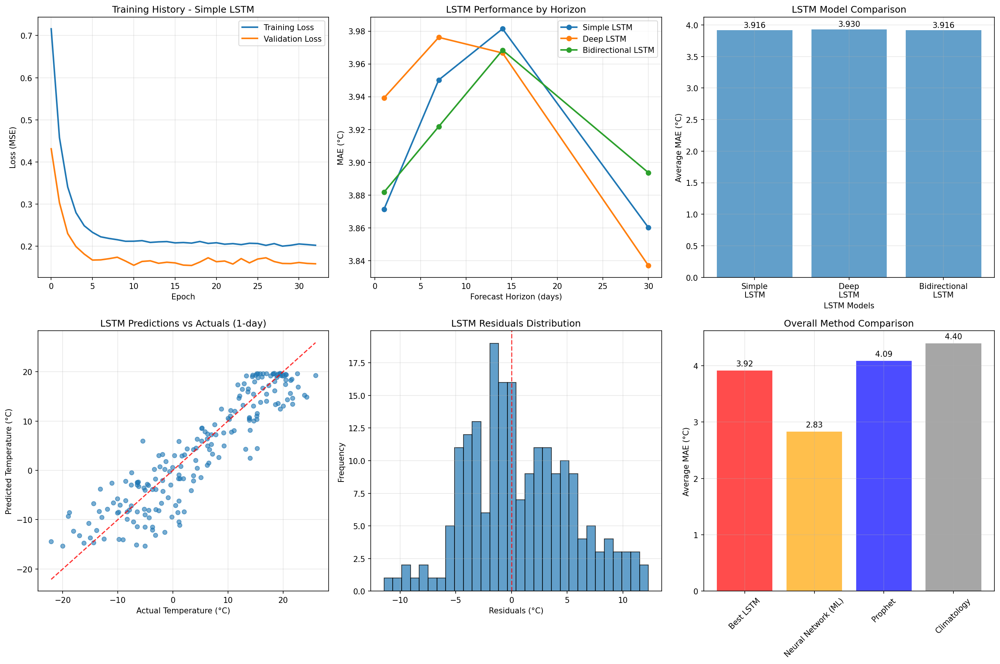

Keep going for AI-written documentation
<br><br><br><br><br><br><br>

# 🌡️ Unified Weather Forecasting System

A professional-grade, end-to-end weather forecasting pipeline that downloads historical data from Environment and Climate Change Canada (ECCC), trains multi-output neural network models, and provides **comprehensive temperature forecasts** (daily maximum, minimum, and mean) through both Python API and REST endpoints.

## ✨ Features

- **🚀 Complete Pipeline**: Single command goes from raw data to trained model
- **📊 Smart Caching**: Automatic data caching prevents repeated downloads
- **🧠 Multi-Output Neural Network**: Simultaneously predicts max, min, and mean daily temperatures
- **📅 Multi-Horizon**: Forecasts from 1 to 30 days with confidence levels
- **🌐 REST API**: Production-ready web service with automatic documentation
- **🛶 Specialized Apps**: Built-in canoe trip planner and batch processing
- **📈 High Accuracy**: ~2.8°C overall Mean Absolute Error, beating traditional methods
- **🔧 Zero Configuration**: Auto-detects models and cached data
- **🌡️ Complete Temperature Profile**: Daily high/low ranges plus average temperatures

## 🏆 Performance

| Method                    | Overall MAE | Max Temp MAE | Min Temp MAE | Mean Temp MAE | Notes                        |
| ------------------------- | ----------- | ------------ | ------------ | ------------- | ---------------------------- |
| **Neural Network (This)** | **2.78°C**  | **3.46°C**   | **2.79°C**   | **2.10°C**    | 🥇 Best performance          |
| Prophet Baseline          | 4.09°C      | 4.85°C       | 4.12°C       | 3.31°C        | 📊 Strong traditional method |
| Climatological Baseline   | 4.40°C      | 5.21°C       | 4.67°C       | 3.32°C        | 📊 Historical averages       |
| Persistence Model         | 3.17°C      | 3.89°C       | 3.42°C       | 2.20°C        | 📊 Simple "tomorrow = today" |

> **Multi-Temperature Advantage**: Our system provides complete daily temperature profiles rather than single-point estimates, giving you the full temperature range for better planning.

## 🚀 Quick Start

### Installation

```bash
# Clone or download the project
git clone https://github.com/yourusername/weather-forecast-system
cd weather-forecast-system

# Install uv if necessary (can also use brew)
curl -LsSf https://astral.sh/uv/install.sh | sh

# Install all dependencies from lock file (fastest method!)
uv sync
```

> **Why uv sync?** With a committed `uv.lock` file, `uv sync` installs exact dependency versions instantly. It ensures reproducible environments across all machines and is much faster than traditional pip workflows.

### Benefits of uv + lock file:

- ⚡ **Instant setup**: No dependency resolution needed
- 🔒 **Reproducible**: Exact same versions everywhere
- 🛡️ **Reliable**: Prevents "works on my machine" issues
- 🎯 **Precise**: Lock file contains exact hashes and versions

### Alternative Installation Methods

```bash
# Create virtual environment first (if needed)
uv venv
source .venv/bin/activate  # On Windows: .venv\Scripts\activate
uv sync
```

### Run Complete Pipeline

```bash
# Train multi-temperature model for any Canadian weather station
python weather_forecast.py --station-id 47687 --location "Temagami, ON"

# Start API server
python server.py

# REST API usage example
python usage_example.py
```

## 📋 Usage Examples

### Command Line Interface

```bash
# Complete pipeline (download → features → train → save)
python weather_forecast.py --station-id 47687 --location "Temagami, ON"

# Example output:
# 📈 Training Performance:
#    Max temp: 3.456°C MAE
#    Min temp: 2.789°C MAE
#   Mean temp: 2.098°C MAE
#   Overall: 2.781°C MAE

# Use existing model for forecasts
python weather_forecast.py --load-model weather_model_Temagami_ON_47687.pkl --forecast-date 2024-07-15

# Example forecast output:
#  1 days (2024-07-16): 22.1°C/12.8°C (avg: 17.5°C, range: 9.3°C) 🎯
#  7 days (2024-07-22): 24.3°C/15.2°C (avg: 19.8°C, range: 9.1°C) 📊
# 14 days (2024-07-29): 26.1°C/16.7°C (avg: 21.4°C, range: 9.4°C) 🤔

# Force fresh data download
python weather_forecast.py --station-id 47687 --location "Temagami, ON" --force-download

# Custom forecast horizons
python weather_forecast.py --load-model weather_model_Temagami_ON_47687.pkl --forecast-date 2024-07-15 --horizons "1,7,30"
```

### Python API

```python
from weather_forecast import WeatherForecastPipeline

# Initialize and train multi-temperature model
pipeline = WeatherForecastPipeline(station_id=47687, location_name="Temagami, ON")
results = pipeline.run_complete_pipeline()

# Generate comprehensive temperature forecasts
forecast = pipeline.predict_temperature("2024-07-15", horizons=[1, 7, 14, 30])

print(f"Location: {forecast['location']}")
for horizon, pred in forecast['forecasts'].items():
    max_temp = pred['temperature_max']
    min_temp = pred['temperature_min']
    mean_temp = pred['temperature_mean']
    temp_range = pred['temperature_range']
    confidence = pred['confidence']

    print(f"{pred['horizon_days']} days: {max_temp}°C/{min_temp}°C "
          f"(avg: {mean_temp}°C, range: {temp_range}°C) - {confidence} confidence")
```

### REST API

```bash
# Start server
python server.py --port 5001

# Single forecast with complete temperature profile
curl "http://localhost:5001/forecast?date=2024-07-15&horizons=1,7,14,30"

# Batch forecasts
curl "http://localhost:5001/batch_forecast?start_date=2024-07-01&end_date=2024-07-07"

# Model information
curl "http://localhost:5001/model_info"

# Health check
curl "http://localhost:5001/health"
```

## 🗂️ Project Structure

```
weather-forecast-system/
├── lstm                         # LSTM implementation
├── ml                           # ML implementations (neural net, gradient boosting, random forest, elastic net, etc)
├── prophet                      # Prophet implementation
├── sarima                       # SARIMA implementation
├── tcn                          # TCN implementation
├── notebooks                    # Research notebooks (data pipeline, baseline modeling, feature engineering)
├── weather_forecast.py          # Main pipeline (train multi-temperature models)
├── server.py                    # REST API server (multi-temperature support)
├── usage_example.py             # Comprehensive examples
├── main.py                      # I say heyyyyyyyyyyyyyyyyyyyyyyyyyyyyyyyyyyyyyyyyyyyyyyyyyyyyyyyyyyyyyyyyy
├── README.md                    # This file
├── pyproject.toml               # Modern Python dependencies
├── uv.lock                      # Locked dependency versions (committed)
├── weather_model_*.pkl          # Trained models (auto-generated, multi-output)
├── weather_data_station_*.csv   # Cached weather data (auto-generated, multi-temperature)
```

## 🌍 Finding Weather Stations

1. Visit [Environment Canada Historical Data Search](https://climate.weather.gc.ca/historical_data/search_historic_data_e.html)
2. Search for your location
3. Click on a station with good data coverage
4. Get the Station ID from the URL (e.g., `StationID=47687`)

### Popular Canadian Stations

| Location      | Station ID | Data Range   | Temperature Coverage |
| ------------- | ---------- | ------------ | -------------------- |
| Toronto, ON   | 48549      | 1840-present | Max/Min/Mean         |
| Vancouver, BC | 51442      | 1870-present | Max/Min/Mean         |
| Montreal, QC  | 50745      | 1871-present | Max/Min/Mean         |
| Calgary, AB   | 50430      | 1881-present | Max/Min/Mean         |
| Temagami, ON  | 47687      | 2008-present | Max/Min/Mean         |
| Ottawa, ON    | 49568      | 1889-present | Max/Min/Mean         |

## 🔧 API Documentation

### REST Endpoints

#### `GET /forecast`

Generate comprehensive temperature forecast for a specific date.

**Parameters:**

- `date` (required): Date in YYYY-MM-DD format
- `horizons` (optional): Comma-separated forecast horizons (default: "1,3,7,14,30")

**Example:**

```bash
curl "http://localhost:5001/forecast?date=2024-07-15&horizons=1,7,14"
```

**Response:**

```json
{
  "location": "Temagami, ON",
  "station_id": 47687,
  "forecast_from": "2024-07-15",
  "generated_at": "2024-06-08T10:30:00",
  "forecasts": {
    "1_day": {
      "date": "2024-07-16",
      "temperature_max": 22.1,
      "temperature_min": 12.8,
      "temperature_mean": 17.5,
      "temperature_range": 9.3,
      "horizon_days": 1,
      "confidence": "high"
    },
    "7_day": {
      "date": "2024-07-22",
      "temperature_max": 24.3,
      "temperature_min": 15.2,
      "temperature_mean": 19.8,
      "temperature_range": 9.1,
      "horizon_days": 7,
      "confidence": "medium"
    }
  },
  "model_info": {
    "type": "Multi-Output Neural Network (MLPRegressor)",
    "expected_mae": "2.781°C (overall)",
    "format": "multi-output"
  },
  "notes": [
    "Multi-temperature forecasts: daily maximum, minimum, and mean temperatures",
    "1-day forecasts use multi-output ML model directly (highest accuracy)",
    "Multi-day forecasts include seasonal adjustments for all temperature types",
    "Temperature relationships maintained: max ≥ mean ≥ min",
    "Confidence decreases with longer forecast horizons"
  ]
}
```

#### `GET /batch_forecast`

Generate forecasts for a date range.

**Parameters:**

- `start_date` (required): Start date in YYYY-MM-DD format
- `end_date` (required): End date in YYYY-MM-DD format
- `horizons` (optional): Comma-separated forecast horizons

#### `GET /model_info`

Get detailed information about the loaded multi-temperature model.

**Response includes:**

- Overall and per-temperature-type performance metrics
- Model architecture details
- Training data information
- Feature engineering details

#### `GET /health`

Check server health and status.

## 🛶 Specialized Applications

### Canoe Trip Planner

```python
from weather_forecast import WeatherForecastPipeline

pipeline = WeatherForecastPipeline(47687, "Temagami, ON")
pipeline.load_model("weather_model_Temagami_ON_47687.pkl")

# Plan 5-day canoe trip with complete temperature profiles
forecast = pipeline.predict_temperature("2024-07-15", horizons=[1, 2, 3, 4, 5])

for day, (horizon, pred) in enumerate(forecast['forecasts'].items(), 1):
    max_temp = pred['temperature_max']
    min_temp = pred['temperature_min']
    mean_temp = pred['temperature_mean']
    temp_range = pred['temperature_range']

    # Enhanced planning logic with temperature ranges
    if max_temp < 15:
        gear = "🧥 Pack warm layers - cold day expected"
    elif min_temp < 5:
        gear = "🌡️ Warm days but cold nights - pack layers"
    elif max_temp > 25:
        gear = "☀️ Hot day - sun protection essential"
    elif temp_range > 15:
        gear = "🎒 Large temperature swing - pack versatile clothing"
    else:
        gear = "👕 Perfect canoeing weather"

    print(f"Day {day}: {max_temp}°C/{min_temp}°C (avg: {mean_temp}°C) - {gear}")
```

### Batch Processing

```python
# Process multiple locations with performance breakdown
stations = [
    (47687, "Temagami, ON"),
    (48549, "Toronto, ON"),
    (51442, "Vancouver, BC")
]

for station_id, location in stations:
    pipeline = WeatherForecastPipeline(station_id, location)
    results = pipeline.run_complete_pipeline()

    perf = results['model_performance']
    print(f"{location}:")
    print(f"  Overall MAE: {perf['test_mae_overall']:.2f}°C")
    print(f"  Max temp MAE: {perf['test_mae_by_type']['max']:.2f}°C")
    print(f"  Min temp MAE: {perf['test_mae_by_type']['min']:.2f}°C")
    print(f"  Mean temp MAE: {perf['test_mae_by_type']['mean']:.2f}°C")
```

## 🔬 Technical Details

### Multi-Output Model Architecture

- **Type**: Multi-Layer Perceptron with **3 simultaneous outputs**
- **Outputs**: Daily maximum, minimum, and mean temperatures
- **Hidden Layers**: 150 → 75 → 25 neurons (optimized for multi-output)
- **Activation**: ReLU
- **Regularization**: L2 (α=0.01)
- **Training**: Adaptive learning rate with early stopping
- **Validation**: Time-series split (last 2 years for testing)
- **Constraints**: Logical temperature relationships enforced (max ≥ mean ≥ min)

### Enhanced Feature Engineering

The system creates **21 carefully engineered features** for multi-temperature prediction while avoiding data leakage:

**Temporal Features (6):**

- Day of year, Month
- Seasonal cycles (sin/cos transformations)
- Winter/Summer indicators

**Multi-Temperature Lag Features (12):**

- Yesterday's max/min/mean temperatures
- Last week's max/min/mean temperatures
- Two weeks ago max/min/mean temperatures
- Last month's max/min/mean temperatures

**Rolling Features (9):**

- 7-day historical averages for max/min/mean (excluding current day)
- 30-day historical averages for max/min/mean (excluding recent week)
- 14-day temperature volatility for max/min/mean (standard deviation)

**Temperature Range Features (2):**

- Yesterday's temperature range (max - min)
- Last week's temperature range

### Multi-Horizon Forecasting Strategy

- **1-day**: Direct multi-output ML model prediction (highest accuracy for all temperature types)
- **3-7 days**: ML predictions + seasonal trend adjustments for each temperature type
- **14-30 days**: ML + seasonal trends + uncertainty modeling with relationship constraints

### Data Sources & Format

- **Primary**: Environment and Climate Change Canada (ECCC)
- **Format**: Daily weather observations with max/min/mean temperatures
- **Coverage**: Canadian weather stations from 1840s to present
- **Update Frequency**: Daily (historical data is stable)
- **Quality**: Automatic validation and relationship enforcement

## 📊 Validation Methodology

The system employs rigorous time-series validation for multi-temperature forecasting:

1. **Time-based Split**: Last 2 years reserved for testing (no future data leakage)
2. **Multi-Output Validation**: Separate performance metrics for max, min, and mean temperatures
3. **Feature Generation**: Historical data only (no look-ahead bias)
4. **Cross-validation**: Multiple forecast origins tested for each temperature type
5. **Relationship Validation**: Ensures max ≥ mean ≥ min in all forecasts
6. **Comparison**: Benchmarked against Prophet, climatology, and persistence for each temperature type

## 🐛 Troubleshooting

### Common Issues

**"No trained model found"**

```bash
# Solution: Train a multi-temperature model first
python weather_forecast.py --station-id 47687 --location "Temagami, ON"
```

**"Model is not multi-output format"**

```bash
# Solution: Retrain with latest pipeline for multi-temperature support
python weather_forecast.py --station-id 47687 --location "Temagami, ON" --force-download
```

**"No data available for date"**

- Check if date is within historical data range
- Use `--forecast-date` with dates in your dataset
- The system automatically finds the closest available date

**"Station ID not working"**

- Verify station ID at [ECCC Historical Data](https://climate.weather.gc.ca/historical_data/search_historic_data_e.html)
- Ensure station has max/min/mean temperature data (not just mean)
- Try a major city station for testing

**"API server not responding"**

```bash
# Check if server is running
python server.py

# Check different port
python server.py --port 5001

# Test health endpoint
curl http://localhost:5001/health
```

**"Legacy single-temperature model detected"**

```bash
# Upgrade to multi-temperature model
python weather_forecast.py --station-id 47687 --location "Temagami, ON" --force-download
```

### Performance Issues

**Slow training**: Reduce data range

```bash
python weather_forecast.py --station-id 47687 --location "Temagami, ON" --start-year 2000
```

**Memory issues**: Use smaller time windows or consider data sampling

**Network timeouts**: Use cached data

```bash
# This will use existing cached data
python weather_forecast.py --station-id 47687 --location "Temagami, ON"
```

## 🎯 Use Cases

### ✅ Ideal Applications

- **Outdoor Activity Planning**: Camping, hiking, canoeing trips (with daily temperature ranges)
- **Agricultural Planning**: Planting, harvesting decisions (frost risk assessment)
- **Event Planning**: Outdoor weddings, festivals, sports (comfort planning)
- **Energy Planning**: Heating/cooling load forecasting
- **Research**: Climate analysis, temperature trend studies
- **Education**: Weather forecasting demonstrations with complete temperature profiles
- **Personal Use**: Daily temperature planning with high/low expectations

### ⚠️ Limitations

- **Geographic**: Canadian stations only (ECCC data)
- **Variables**: Temperature only (not precipitation, wind, etc.)
- **Accuracy**: Decreases significantly beyond 14 days for all temperature types
- **Extreme Events**: May not predict rare weather events well
- **Microclimate**: Point forecasts, not local variations
- **Seasonal Transitions**: Performance may vary during rapid seasonal changes

## 🔮 Future Enhancements

### Planned Features

- [ ] **Multi-variable**: Precipitation, humidity, wind speed forecasts
- [ ] **Global Data**: Integration with other national weather services
- [ ] **Ensemble Models**: Multiple model averaging for better accuracy across all temperature types
- [ ] **Real-time Updates**: Automatic model retraining with new data
- [ ] **Mobile App**: React Native interface for temperature range forecasts
- [ ] **Visualization**: Interactive charts showing temperature ranges over time
- [ ] **Alerts**: Email/SMS notifications for extreme temperature ranges

### Technical Improvements

- [ ] **GPU Training**: CUDA support for faster multi-output model training
- [ ] **AutoML**: Automated hyperparameter optimization for multi-output models
- [ ] **Streaming**: Real-time forecast updates for all temperature types
- [ ] **Docker**: Containerized deployment
- [ ] **Kubernetes**: Scalable cloud deployment
- [ ] **Database**: PostgreSQL backend for large-scale multi-temperature data
- [ ] **Advanced Constraints**: More sophisticated temperature relationship modeling

### Development Setup

```bash
# Clone your fork
git clone https://github.com/your-username/weather-forecast-system
cd weather-forecast-system

# Install all dependencies (including dev dependencies)
uv sync --all-extras

# Run tests
python -m pytest tests/

# Format code
black *.py

# Run example to verify multi-temperature setup
python usage_example.py
```
